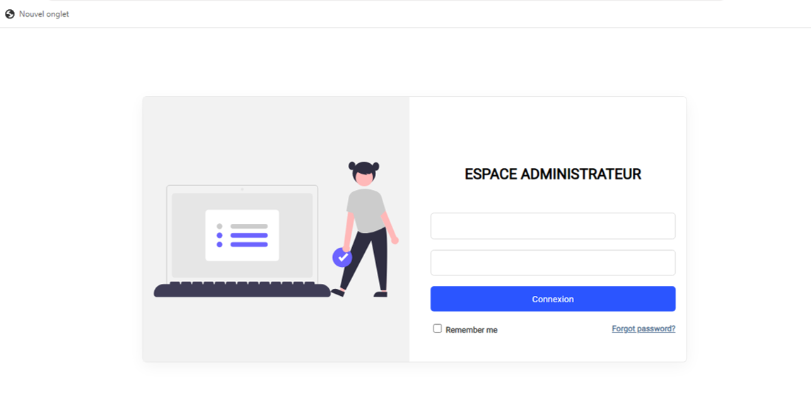
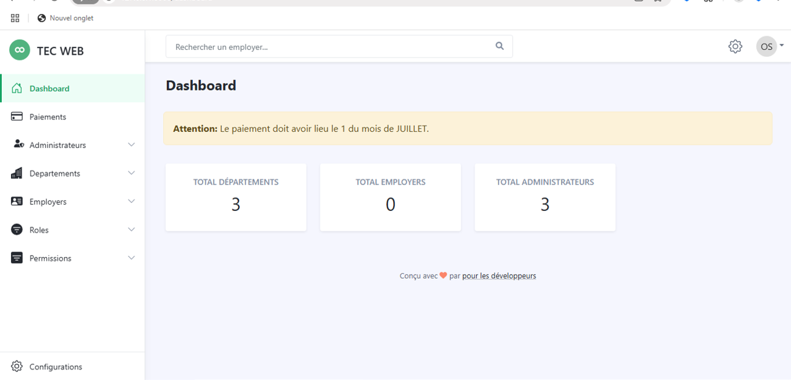
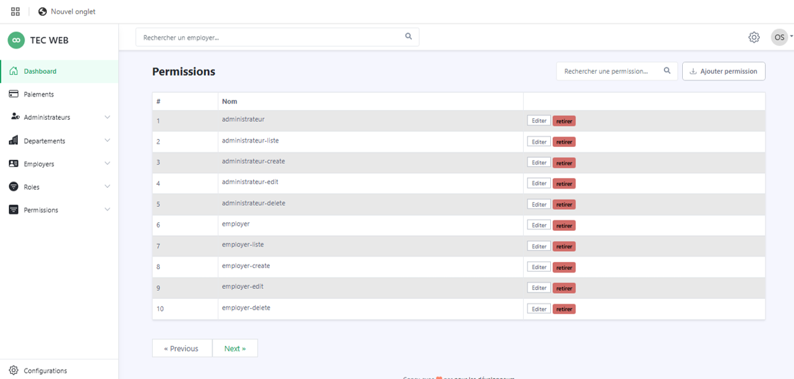
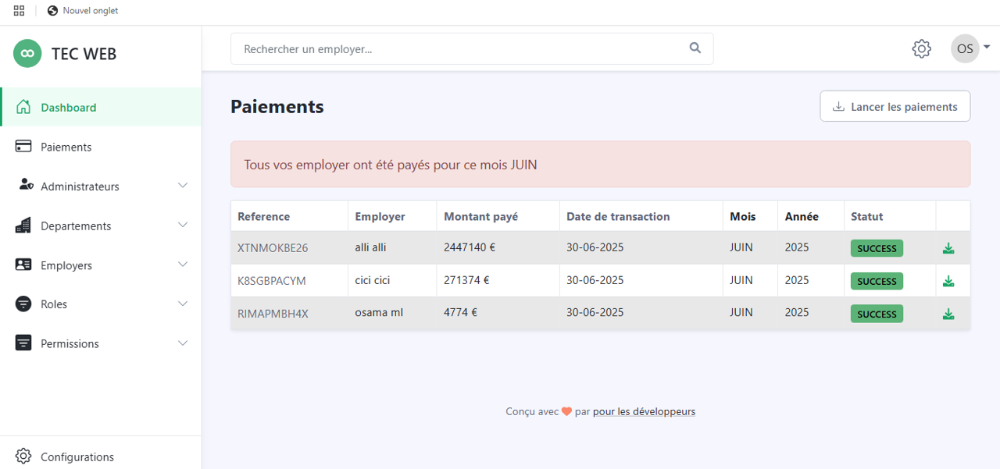
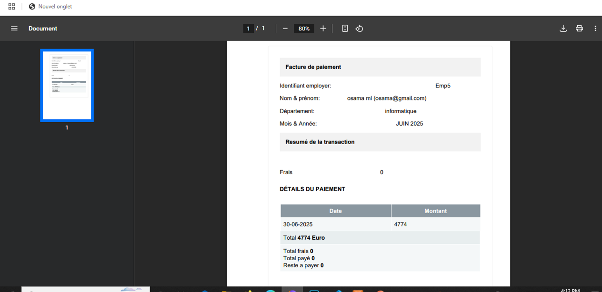
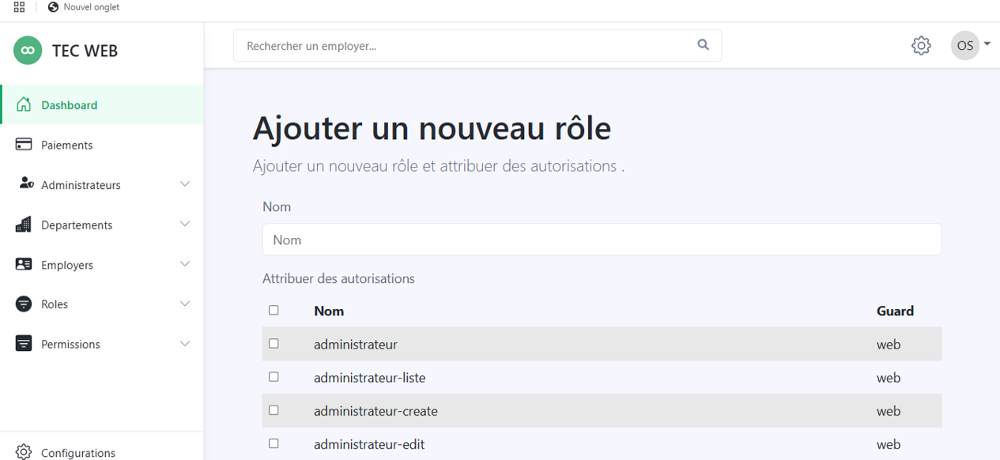

# Gestion des Employer

_Gestion des Employer_ est une application web développée avec Laravel, dédiée à la gestion complète des employés, des départements, des paiements, des rôles, des permissions, ainsi que de la configuration globale de l’organisation.

Elle offre une interface conviviale pour l’administration des ressources humaines avec un système d’authentification, de notifications par email et une gestion dynamique des autorisations.

---

## 🚀 Fonctionnalités principales

### 👤 Utilisateurs & Authentification

-   Création d’un nouvel utilisateur avec assignation directe d’un rôle.
-   Envoi automatique d’un email contenant un lien sécurisé pour définir son mot de passe.
-   Connexion sécurisée avec vérification des permissions via middleware.

### 🏢 Gestion des Départements

-   Création, modification et suppression de départements.
-   Attribution des employés à des départements spécifiques.

### 👨‍💼 Gestion des Employés

-   Ajout, modification et suppression des employés.
-   Visualisation des profils complets.

### 💰 Gestion des Paiements

-   Suivi mensuel des paiements des employés.
-   Historique détaillé des salaires.
-   Définition d'une _date mensuelle de paiement_ configurable.
-   🧾 _Génération de factures PDF_ à partir des paiements via laravel-dompdf (téléchargement direct de la fiche de paie).

### ⚙️ Paramètres & Configuration

-   Définition des membres de l’équipe de développement.
-   Gestion des variables système via une interface dédiée.

### 🔐 Gestion des Rôles & Permissions

-   Interface utilisateur complète pour :
    -   Créer, modifier et supprimer des _rôles_.
    -   Gérer dynamiquement les _permissions_ associées à chaque rôle.
-   Attribution de rôles aux utilisateurs depuis l’interface d’administration.
-   Middleware (permission:nom) pour protéger les routes et fonctionnalités.
-   Basé sur le package [Spatie Laravel Permission](https://spatie.be/docs/laravel-permission).

---

## 🛠️ Technologies utilisées

-   Laravel 10+
-   Spatie Laravel Permission
-   DomPDF (barryvdh/laravel-dompdf)
-   MySQL
-   Bootstrap / Tailwind CSS
-   Gmail SMTP
-   Laravel Breeze ou Jetstream (optionnel)

---

## ✉️ Configuration des emails

L'application utilise _Gmail SMTP_ pour envoyer des emails aux utilisateurs lors de la création de compte.

Configurer votre fichier .env comme suit :

````dotenv
MAIL_MAILER=smtp
MAIL_HOST=smtp.gmail.com
MAIL_PORT=587
MAIL_USERNAME=votre.email@gmail.com
MAIL_PASSWORD=mot_de_passe_de_l'application
MAIL_ENCRYPTION=tls
MAIL_FROM_ADDRESS="votre.email@gmail.com"
MAIL_FROM_NAME="Gestion Employer"


## 👀 Aperçu de l'application

### 🔐 Page de connexion



---

### 🏠 Tableau de bord



---

### ✅ Liste des permissions



---
### 📄 Liste des paiements


---

### 🧾 Facture de paiement (PDF généré)



### ➕ Ajout d’un rôle


Écrire à Zahrati Malaki

## 📦 Installation

```bash
git clone https://github.com/votre-utilisateur/gestion-des-employer.git
cd gestion-des-employer
composer install
cp .env.example .env
php artisan key:generate
````
